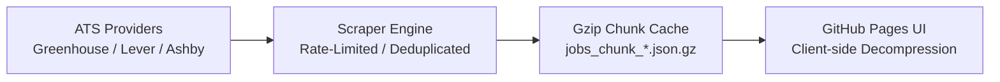

# 🤖 AgenticJobSearch

> **High-Throughput Autonomous Job Ingestion, Cache-Optimized Indexing & Zero-Infrastructure Client-Side Search Engine.**

---

## 🌐 Live Interactive Testing Page

Search and filter through the ingested multi-ATS job dataset directly in your browser without spinning up a local server:

👉 **[Launch Live Static Dashboard](https://cs-surya.github.io/AgenticJobSearch/)**

---

## 📌 Overview

**AgenticJobSearch** is an intelligent, end-to-end framework designed to streamline job discovery and application workflows across major Applicant Tracking Systems (ATS).

* **Phase 1 (Active):** High-throughput automated scrapers across Greenhouse, Lever, Ashby, and Direct career portals. Data is deduplicated, chunked, and compressed into `.json.gz` formats, enabling client-side search via web streams with zero server hosting costs.
* **Phase 2 (Roadmap):** Local vector embeddings (`FastEmbed`), local LLM RAG (`Ollama / llama3.1`), dynamic PDF resume tailoring (`Typst`), and Playwright automation for one-click application submissions.

---

## 🚀 Phase 1: Core Architecture & Features

### 1. Ingestion & Compression Workflow



### 2. Key Capabilities

* **Multi-ATS Ingestion:** Modular scrapers built for Greenhouse (`boards.greenhouse.io`), Lever (`jobs.lever.co`), and Ashby (`jobs.ashbyhq.com`).
* **Client-Side Stream Decompression:** Uses browser-native `DecompressionStream` to parse compressed chunks directly in memory without server compute.
* **Fast In-Browser Search:** Real-time filtering across titles, company tags, locations, and ATS providers with pagination controls.
* **Automated Sync:** Designed to run scheduled scrapers via GitHub Actions to keep job listings fresh.

---

## 📁 Repository Structure

```text
AgenticJobSearch/
├── .github/workflows/        # Automated scraping & cache update actions
├── data/cache/               # Partitioned & compressed job chunks (.json.gz)
├── services/scrapers/        # Modular ATS scrapers (Greenhouse, Lever, Ashby)
├── scripts/                  # Cache consolidation & ingestion triggers
├── static/                   # Static dashboard (index.html, styles, app.js)
└── requirements.txt          # Python dependencies

```

---

## 🛠️ Quick Start

### 1. Installation

```bash
git clone https://github.com/cs-surya/AgenticJobSearch.git
cd AgenticJobSearch

python -m venv venv
source venv/bin/activate    # On Windows: venv\Scripts\activate
pip install -r requirements.txt

```

### 2. Ingest Jobs & Build Cache

```bash
python scripts/run_scrapers.py

```

### 3. Run Static UI Locally

```bash
cd static
python -m http.server 8000

```

Visit `http://localhost:8000` in your browser.

---

## 🔮 Phase 2 Proposal: Autonomous Apply Engine

| Feature | Description |
| --- | --- |
| **384-d Semantic Vector Matcher** | Real-time cosine similarity scoring between candidate profile (`config/profile.json`) and job requirements via `FastEmbed`. |
| **Local LLM Form Agent (`Ollama`)** | Answers custom open-ended screening questions, salary expectations, and work authorizations with zero conversational filler. |
| **Universal DOM Automation (`Playwright`)** | Pierces nested iframes, Shadow DOMs, and handles React-Select and location autocomplete dropdowns with native React synthetic events. |
| **Preview & Verify Modal** | Captures full-page headless snapshots for review prior to live browser submission. |
| **Dynamic Typst Resume Compiler** | Rewrites bullet points to match job descriptions and compiles a tailored PDF on the fly. |
| **SQLite Application Tracker** | Logs submission status (`APPLIED`, `FAILED`), timestamps, and verification proof screenshots. |

---

## 📄 License

Distributed under the MIT License. See `LICENSE` for more information.
